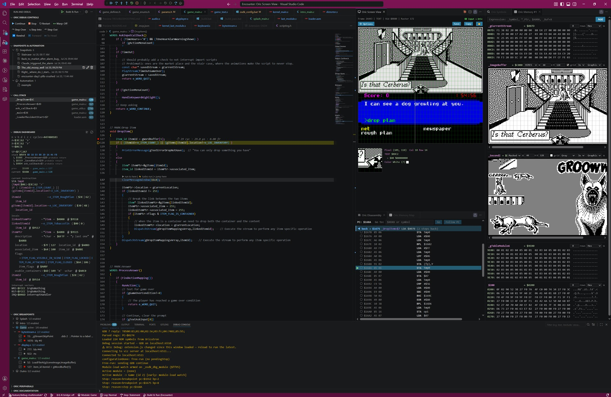

# Panels

The sidebar views and the dockable webview panels.



*A session in progress: sidebar panels on the left, the Screen View and memory views on the right.*

---

All of these appear in the **Run & Debug** sidebar (`Ctrl+Shift+D`) while a session is active:

| Panel | Description |
|---|---|
| **Oric Debug Controls** | A compact toolbar of the Oric-specific actions (warp, replay rewind/forward/to-head, skip, reset cycles, show current location, snapshot) so they're one click away without hunting the Command Palette. |
| **Debug Dashboard** | Everything you need at the moment of a stop, in one panel — see [its own section below](#debug-dashboard). Flags and cycles, A/X/Y, SP with a preview of the stack, where you came from and where you are, the current instruction, the C statement with its variables decoded, locals, and the interrupt vectors. |
| **Oric Breakpoints** | All breakpoints as a tree: **module → file → line**, with a child row per condition / hit-count / watchpoint property. Enable/disable or delete at any level (all / module / file / line), and optionally *follow the active module*. |
| **Snapshots & Automation** | Two groups in one panel: *Snapshots* — saved machine states for this project, restore/rename/delete (see [Snapshots](debugging.md#snapshots)); *Automation* — runnable scripts (`automation/*.js`) with a **▶ Run** button each (see [Automation scripting](automation.md)). |
| **Oric Peripherals** | Live state of the VIA 6522, AY-3-8912 (PSG), WD1793 floppy disk controller, Microdisc interface, and ACIA 6551 serial controller. |
| **Oric Documentation** | Quick links: the extension manual, the internal **XA** and **6502** references, and the external **OSDK website** & **Defence Force forum**. |

(Zero-page variables are no longer a separate panel — view them in the **Symbol Browser** with the group filter set to *Zero Page*.)

---

## Debug Dashboard

The state of the machine at the current stop, in one panel. Top to bottom:

| Row | Shows |
|---|---|
| flags + cycles | `n v b d i z c` — **UPPERCASE = set, lowercase = clear** (the usual 6502-monitor convention), so the state does not depend on colour alone. Plus the cycle counter. |
| `A` / `X` / `Y` | one register per row, with the full `$hex\|decimal\|%binary\|'char'` decode, and the typed value when the register carries a type tag. |
| `SP` + stack | the stack pointer, then the bytes actually pushed, then any **probable return addresses** — see below. |
| `prev` / `current` | the previous and current PC, each as address · `file:line`. Both are clickable; `prev` is dimmed. Useful when the previous PC is an `RTI` or a `JSR` from a distant file. |
| current instruction | the 6502 instruction at the PC, with its operand decoded to the symbol/type it resolves to. |
| C statement | on a C line, the statement plus each variable on it decoded (globals, locals, members, subscripts, enums). |
| locals | the current frame's locals, always expanded, one level of struct/array flattened. |
| interrupt vectors | `NMI` / `RST` / `IRQ`, each with the address and the name of the routine it points at. |

### The stack preview

The rows under `SP` show the pushed bytes, read from `$0100+SP+1` upward (the 6502's `SP` points at the next **free** slot), most recently pushed
first, followed by up to three **probable return addresses**:

```
SP=$F7|247
stack $01F8 8D 18 D3 88 2D 1A 46 FB
  ↳ $188E _ProcessAnswer+$2D probable return
  ↳ $D319 _SavedData3+$39   probable return
  ↳ $88D4 ask_callback+$3   probable return
```

A `JSR` pushes its return address minus one, high byte first, so each adjacent `(lo,hi)` pair is
decoded as `(lo | hi<<8) + 1`. Only pairs resolving to a known symbol are listed. They are labelled
**probable** because any two data bytes can resolve to a routine by coincidence.

### Click-to-definition

Identifiers in the panel jump to their definition: symbols, enum members, type names, `#define`s,
the interrupt-vector routine names, and the `file:line` on the `prev`/`current` rows.

### Title-bar toggles

| Button | Effect |
|---|---|
| **wrap** | Wrap long rows instead of clipping them. Off by default: clipping keeps rows aligned and the panel compact, wrapping shows the whole of a long path or a wide array and uses more vertical space. Wrapped rows are given a hanging indent. Also the `oric-debug.wrapPanelRows` setting. |
| **%binary** | Show or hide the `%binary` column in decoded values (`$02\|2\|%00000010` vs a compact `$02\|2`). Also the `oric-debug.showBinary` setting, the **Oric: Toggle Binary Column in Values** command, and `bin on` / `bin off` in the Debug Console. All four write the same setting. |

---

## Webview Panels

### Memory View

Expression-based memory viewer supporting hex, words, decimal, and binary display formats.

Open via command palette: **Oric: Memory View**

### Memory Heatmap

Real-time visualization of memory access patterns across the Oric's 64KB address space.

Open via command palette: **Oric: Memory Heatmap**

- **Color mapping**: Red = CPU writes, Green = CPU reads, Blue = ULA video fetches. Overlapping accesses blend additively (yellow = read+write, cyan = read+ULA, etc.)
- **Layout**: Four top strips (Zero Page, Stack, Page 2, I/O), main RAM ($0400-$BFFF), and ROM/RAM ($C000-$FFFF) with ROMDIS-aware labeling
- **Address crosshair**: Hovering over a symbol in the Symbol Browser or editor source code draws a crosshair on the heatmap at that address. The crosshair auto-follows the PC on each debug stop.
- **Hover tooltip**: Shows the hex address under the cursor
- **Auto-connect**: Connects to Oricutron's visualization stream on `gdb_port + 1`
- **Pause-aware**: Freezes the display when the emulator is paused; resumes when execution continues

### Screen View

Live Oric screen display rendered from Oricutron's 240x224 screen buffer.

Open via command palette: **Oric: Screen View**

- **Interactive**: the Oric keyboard works while the view is focused — type directly into the running program.
- **CRT shader**: optional WebGL CRT effect (curvature-aware scanlines; the grid and hover crosshair follow the curvature). **Pixel-aspect toggle** switches between square pixels and the Oric's true pixel aspect.
- **On-screen status (OSD)**: badges show when the emulator is **paused**, running in **turbo/warp**, or being driven by an **automation script** (`● SCRIPT`).
- **Column grid** (6px) and **row grid** (8px) overlays with selectable colors
- **Pixel inspector**: hover to see address, byte value, bit position, and color info
- **Zoom**: configurable zoom factor (2x/4x/6x/8x/12x) and region size
- **Crosshair**: black-white-black crosshair on main view, pixel highlight in zoom
- **Screenshot**: save PNG to project `screenshots/` folder with timestamp
- **Clipboard**: copy screen to clipboard (Windows)
- All settings (grids, color, zoom, aspect, CRT) persisted across reloads

### Symbol Browser

Browsable list of all symbols (runtime symbols from symbol file + `#define` constants from source files).

Open via command palette: **Oric: Symbol Browser**

- **Alias merging**: symbols at the same address are merged into one row, with the master definition listed first
- **Columns**: Name, Address, Size, Value (live during debug), Group (ZP, BSS, Code, Data, Define)
- **Group filter**: dropdown to show only symbols of a specific group
- **Sorting**: click column headers to sort
- **Search**: filter symbols by name
- **Hover to highlight**: hovering a symbol row draws a crosshair on the Memory Heatmap
- **Click to navigate**: click any symbol name to jump to its source definition (requires V2 symbol file or `#define` in source)
- **Defines**: `#define` constants from `.s`, `.h`, and `.asm` files are included with their resolved values

#### Watch (built into the Symbol Browser)

The Symbol Browser doubles as a **watch panel**, kept above the symbol table and separated by a draggable splitter:

- **Watch dot** (first column): click the ○ next to any symbol to watch it (● = watched). Watched entries appear in the section at the top with their live, decoded value.
- **Watch an arbitrary expression**: type it in the search box and press **Enter** (or the **+ Watch** button) — casts like `(item_id)a`, registers, and `$hex` addresses all work, no matching row required.
- **Expandable**: watched structs/pointers expand into fields/elements with indent guides; `@stream` pointers expand into decoded commands.
- **Decoded values**: everything renders through the one type path — enums by name, flags decomposed, `@bcd`/strings/pointers, with the decoded name tinted distinctly from the raw `$hex|dec|%binary`.
- **Inactive-module entries** fold into a collapsed *Inactive (n)* group showing which module owns them, and migrate back automatically on module switch (so a multi-module project's watch list stays clean instead of erroring).
- **Stale mode**: when the session ends, the last live values stay visible (greyed) so you can edit code against the program's final state.
- **Search history** persists per workspace behind the ▾ button.
- Remove a watch with the ✕ or by clicking its dot off. Entries persist per workspace.

### Memory Map

Open via command palette: **Oric: Memory Map**

A built-in memory map (like `osdk_showmap`) generated from the current module's symbols — no external tool, and it **auto-regenerates** whenever symbols change (on build/reload and on module switch, so the *Overlay* tab always reflects the active module). It works while the program is running or stopped, once a session has loaded symbols.

- **Tabs**: *Normal* (`$0400–$BFFF`), *Overlay* (`$C000–$FFFF`), *Zero* (`$00–$FF`).
- **Layout table** — Address · Total · Size · Name(s). Block size = gap to the next symbol; a label starting with `_` or `osdk` is a **section marker** whose *Total* sums every block until the next marker (bold rows). Page-aligned addresses are bold, and co-located labels are listed together (e.g. `_ImageBuffer, _SavedData1`).
- **Largest** — a summary of the biggest sections by total; click one to jump to its row.
- **Search** — incremental filter with per-tab match counts; if the term isn't in the current tab it **auto-jumps** to the tab that has it. Clear with the **×** or **Esc**.
- **Clickable labels** jump to the symbol's definition in source.

### Reference Panels

- **Oric: XA Quick Reference** - searchable XA assembler directive reference
- **Oric: 6502 Opcode Reference** - searchable 6502 instruction set reference with cycle counts
- **Oric Documentation** panel (in the Run & Debug sidebar) — one-click links to this manual, the XA/6502 references, the [OSDK website](https://osdk.org), and the [Defence Force forum](https://forum.defence-force.org). External links prompt once (VS Code's link protection) — add them via *Configure Trusted Domains* to skip it thereafter.

---

[← Documentation index](README.md) · [Extension README](../README.md)
